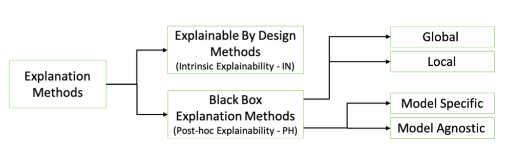
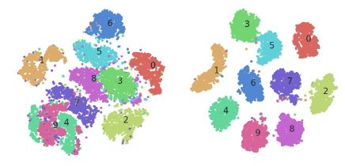
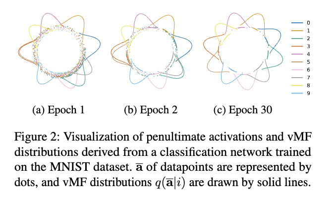
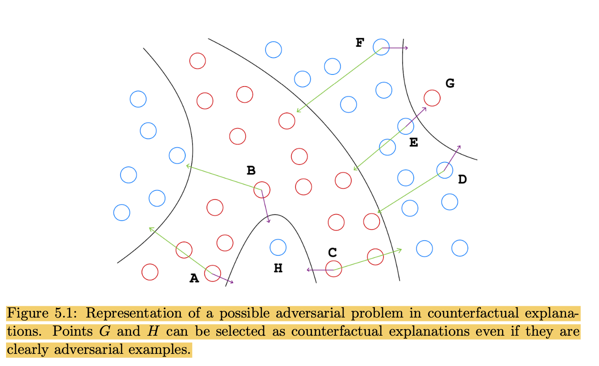
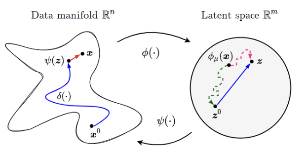
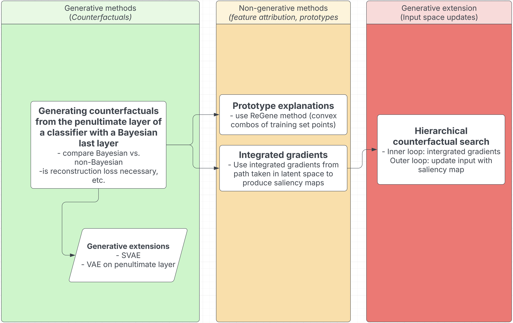

See below a final plan I put together for the last few months of my Master's Thesis. It's a document I developed for my own use, so it's a little informal and not really optimised to be read as an article. Nonetheless, I thought it might be useful to publish it here while my research is still ongoing. You can also find my initial proposal for the project, which builds some these concepts a bit more from the ground up, [here](/projects/thesis).

---

## Background and Motivation
The core goal of my dissertation is to explore how Bayesian last-layer classifiers can allow *explainability* to be achieved by studying the internal latent space of a classification model. 

Bayesian neural networks learn a distribution over their weights, rather than point estimates like in classic neural networks, allowing them to provide strong uncertainty estimates for their predictions. Bayesian last-layer networks modify this by learning a distribution over only the final layer's weights, and have been shown to provide comparable performance to fully Bayesian equivalents. This separates the model's representation learning (deterministic) from it's prediction learning (Bayesian), which has some interesting implications. 

For this dissertation, keeping the first $n-1$ layers of the network deterministic allows us to explore the latent space $z$ of the model while projecting changes back to the input space $x$, all without losing the uncertainty estimates associated with the Bayesian last layer. Since the final layer is still Bayesian, we can guide our exploration of the latent space using the epistemic and aleatoric uncertainties derived from this Bayesian last layer. 

That is, if we feed the latent representations at each step of the exploration through the final layer, the predictions obtained will have fully calibrated Bayesian uncertainty estimates since all of the learned uncertainty estimation is contained within the final layer (i.e. we have not 'skipped' any of the layers necessary for the uncertainty estimation). Previous research has demonstrated that this sort of uncertainty-guided optimisation *implicitly regularises the optimisation to stay on the data manifold.* (i.e. we only explore points in the latent space which correspond to realistic inputs). While this previous research guides an exploration of the input space, leveraging the the uncertainty estimates derived from the entire network, the use of a Bayesian last layer will allow us to conduct our exploration in the more meaningful *latent space*.

<aside>

The next few sections cover some of the background research which motivates the various approaches I have proposed for this dissertation. This starts with a discussion of the relevant XAI methods, before moving on to discuss the structure of the latent space of a classification model and how it might be made more generative by a Bayesian last layer. We then consider ways we might seek to make the latent space of a classifier *more generative*, before developing a proposal for how we might project changes back to the input space, providing feature attribution-based explanations and forgoing the need to generate counterfactual explanations altogether. Finally, we outline a method which could utilise these feature attributions to iteratively generate counterfactual explanations. 

After these discussions, I also provide a roadmap for implementing what will likely be a subset of the proposed approaches. Like I said in the introduction, this document is more of a personal roadmap, so the ideas outlined may not include all the necessary context. Nonetheless, I hope it is useful for anyone who is interested in the project!

</aside>

---

## General discussion of XAI methods

The field of eXplainable AI is vast, and there have been several attempts to provide a taxonomy for the classification of explanation methods. One such example can be seen below:

For this dissertation, we are interested in explaining *black-box* models (neural networks), so we focus only on *post-hoc explainability.* Within this category, our approaches will, at least initially, be model-specific, although they may, in principle, be model-agnostic. Finally, we will seek to develop *local explanations* of individual decisions of the black box, not considering the global behaviour of the model. 

Aside from this taxonomy, we can also categorise explanations as one of the following:

- **Feature importance methods:** where a score is assigned to each input feature according to its importance to the prediction
- **Prototypes:** where relevant training set examples are used to characterise the decision of the black box
- **Counterfactuals:** where a counter-example is given which demonstrates how the original input might be altered to change the resulting prediction

*(for this project, we don’t consider rule-based methods)*

There are many approaches to **feature attribution.** Classic methods include LIME and SHAP, which are perturbation-based and game theory-based, respectively. They both involve making many different alterations to the input and observing the effects on the output.

There are also gradient-based approaches:  in its simplest form, this involves backpropagating the gradients of the prediction with respect to the input features. GRAD-cam upsamples the gradients of the prediction with respect to the final layer to the input dimensions, producing a coarse heatmap of importance. Integrated gradients (INTGRAD) involves moving from a null point (e.g. a black image for image data) to the data point of interest, and observing the gradients of the prediction at each step. All these gradients along the path are integrated, producing a saliency map over the input dimensions.

**Counterfactual methods,** on the other hand, go further by actually specifying the change in input features necessary to change a prediction, not just highlighting input dimensions like feature attribution. The core challenge here is to remain on the data manifold when finding counterfactuals. Otherwise, you find meaningless adversarial examples (e.g. reduce your age to -10 to be approved for a loan!). There are a few ways to do this:

- FACE models the density of the data in the input dimension
- CEM similarly explore the input dimension, but runs the data through an autoencoder at each step and penalises high reconstruction loss (indicating OOD)
- xGEM uses an auxiliary DGM to model the data manifold, and explores its latent space for counterfactuals

This final approach is what inspires CLUE[^1], a foundational piece of literature for this dissertation. CLUE also uses a DGM to provide a latent space suitable for finding counterfactuals. The difference is that CLUE applies it to the Bayesian context, setting out to explain *uncertainty,* instead of optimising for change in prediction (’crossing the decision boundary’).

However, CLUE often does indeed change the prediction. After all, the generative latent space is not designed to be discriminative on the basis of class. It seems to me that CLUE’s results were impressive more generally, as counterfactual explanations, rather than for the specific goal of explaining uncertainty. I suggest that this is because of the additional robustness provided by Bayesian neural networks.

- Counterfactuals are essentially adversarial examples. Only instead of wanting the changes to be imperceptible, we want them to be obvious and make sense based on the data distribution. Bayesian neural networks have been shown to have statistical guarantees for robustness (thanks Andrea!), and so should be particularly capable of guiding a search for *meaningful* counterfactuals.
- Bayesian neural networks act as an additional proxy for the data manifold. One of the core benefits of BNNs is their ability to identify OOD points. The DGM used in CLUE acts as the primary model of the data manifold, but I identify that by guiding the optimisation to minimise the BNN’s uncertainty, you are leveraging the additional understanding of the data manifold provided by the BNN.

The second point can be demonstrated by a subsequent paper “**Generating Interpretable Counterfactual Explanations By Implicit Minimisation of Epistemic and Aleatoric Uncertainties**”[^2]. This paper manages to generate counterfactuals without a generative model. By using deep ensembles to provide estimates of epistemic and aleatoric uncertainties (approximately Bayesian), they are able to guide a direct exploration of the input space to stay on manifold while attempting to change the class of the prediction. The results are quite remarkable - they were able to make alterations to the input images (MNIST) which produced new, realistic digits, with no generative model. This demonstrates the ability of Bayesian uncertainty estimates to approximate the data manifold.

<aside>

My goal in this dissertation is to take inspiration from both of these. A separate generative model is clearly *not necessary* in order to remain close to the data manifold, so long as you have strong Bayesian uncertainty estimates to act as a proxy. However, this does not mean that you have to optimise within the unconstrained and high-dimensional input space. I suggest that we can explore the internal latent space of the classification model. Sure, it isn’t optimised to model the data manifold like the latent space of a VAE, but if we can constrain a search in *input space* to stay on manifold with uncertainty estimates, we can certainly do the same for the lower-dimensional and discriminative latent space of the classification model. Besides, as we will explore later, the latent space of the classification does model the data distribution, just in a different way.

</aside>

---

## Finding counterfactuals and impositions of linearity

This section should discuss the big thesis, how these approaches seem to rely on simple, linear classifiers such that the decision boundary is easily identifiable. Overly simple models are implied to be necessary for interpretability.

We have already discussed methods which explore a latent space which models the data distribution in order to find counterfactuals. The latent space does not model the behaviour of the classifier, it is simply there to identify meaningful directions in the input space. There are methods, however, which have proposed exploring the latent space upon which a classifier draws its decision boundary in order to find counterfactuals. These methods tend to rely on *linearity*.

- The paper “An Interpretable Deep Classifier for Counterfactual Generation”[^3] imposes a supervised objective on a generative model (a VAE + normalising flows). However, the classifier is a Bayesian probit linear regression model, and the method relies on this by finding a trajectory in latent space which crosses the decision boundary. This is in contrast with the gradient-descent optimisation, which is necessary to cross a highly non-linear decision boundary in a neural network classifier.
- The PhD thesis “Understanding and Exploiting the Latent Space to Improve Machine Learning Models eXplainability”[^4] takes this a step further and learns a linear transformation from input to latent space. It demonstrates that this is “inherently interpretable”, but the trade-off between interpretability and performance is clearly present. This approach is unworkable on a non-linear differentiable model like a neural network. **A useful observation from this paper, however, is that latent spaces which are optimised to place data with similar *prediction labels* near one another produce more robust counterfactual explanations (i.e. less likely to be adversarial)**. This bodes well for our approach, as this applies in the classification latent space but not the generative.

I identify a gap here - methods that directly acknowledge the utility of exploring the latent space *upon which the decision boundary is drawn* in search of counterfactuals that explain *that decision boundary* tend to impose linearity to either the representation learning, the prediction learning, or both. On the other hand, methods that are suitable for use on black-box models (i.e. that don't impose linearity) usually explore a *generative* latent space which has nothing to do with the decision boundary of the black box in question. 

---

## Generative vs. non-generative latent spaces

We have discussed the fact that, while the latent space of a classifier is not optimised to model the data distribution, and instead learns to represent the data in such a way that it is highly discriminative, we can guide our optimisation to regions of the latent space that are *in distribution.* However, this doesn’t fully solve the problems of generating counterfactuals - the latent space may indeed have regions where it models a portion of the data distribution, but this does not mean that it retains enough information to reconstruct the data. The non-linear mapping $x→z$ of a neural network is not inherently invertible, particularly if a reconstruction loss is not included in the optimisation objective. 

The section following this one will discuss alternative methods of projecting changes in the latent space back to the input dimensions, but first we will discuss two pieces of research that seek to understand the generative capacity of the classifier’s latent space.

### ReGene and connections to prototypes

**ReGene** is an approach developed in “Classify and Generate: Using Classification Latent Space Representations for Image Generations”[^5] that acts as an alternative to conditional generative models for class-condition generations. Similarly to what we are considering, the paper first trains a classifier and then trains a decoder to reconstruct the image data from the latent space that lies at the penultimate layer. The crucial insight from the paper is its method for controlled generation and staying in distribution. 

They propose keeping the latent embeddings of a few training data points from each class. To sample a new point for generation, you take a **convex combination** of the saved embeddings for the target class. They mathematically demonstrate that this guarantees the new point will be of the same class. So, new points are sampled according to the following formula:

$$
z_{\text{new}} = \alpha_1 z_1 + \alpha_2 z_2 + \dots + \alpha_n z_n, \quad \text{where} \quad \sum_{i=1}^n \alpha_i = 1, \, \alpha_i \geq 0.
$$

If we wanted to leverage this to make sure our exploration is on manifold, we could do the following:

- Add the latent representation of the original data point $z_{\text{orig}}$ to the set of latent points for the class.
- Initialize the weights of the convex combination $\alpha_i$ such that:

$$
\alpha_i =
\begin{cases}
1 & \text{if } z_i = z_{\text{orig}}, \\
0 & \text{otherwise.}
\end{cases}
$$

- This ensures that the point in the latent space corresponds exactly to $z_{\text{orig}}$

We can then gradually adjust the weights $\alpha_i$ to explore the latent space during our optimisation.

<aside>

 This ties in quite interestingly with the concept of ***prototypes*** from XAI. Here, the saved latent embeddings are the prototypes from the training set, and the $\alpha$ values at the end of the optimisation represent the importance of each prototype for reducing uncertainty. In other words, if $\alpha$ for a particular embedding is strong, the message is “be more like this data point to reduce uncertainty”. 
 - This doesn’t even require generative capacity.
 - You could encourage sparsity and penalise distance from the original point, encouraging the selection of 1 or 2 prototypes.

</aside>

### The latent distribution of the classifier

The paper “On The Distribution of Penultimate Activations of Classification Networks”[^6] shows that the activations in the penultimate layer of a classifier approximately follow a vMF distribution (seen below) when the network is trained with cross-entropy loss. The paper provides some applications for this observation which are not relevant to this dissertation, but it will be a useful paper to turn to when seeking to theoretically understand the latent space we are exploring.

The analysis of how this translates to our case still needs some work, but since these distributions are defined by the final layer’s weights, in principle our Bayesian classification layer should have some interesting effects.

In particular, the paper describes how the latent space consists of a von Mises-Fisher distribution of penultimate activations, where each class $i$ corresponds to a vMF component $\text{vMF}(\mathbf{a};\, \mathbf{w}_i, \|\mathbf{w}_i\|\|\mathbf{a}\|)$ , treating the penultimate-layer vector $\mathbf{a}$ as “directional” data on a hypersphere.

If you place a *distribution* (via variational inference or otherwise) over the final-layer weights $\mathbf{w}_i$, then:

- Each class $i$ no longer has a single $\mathbf{w}_i$ ; instead, there is a *distribution* over $\mathbf{w}_i$ *
- Consequently, you would *marginalize* over $\mathbf{w}_i$ to obtain the distribution of $\mathbf{a}$ for each class, e.g. $\int \text{vMF}(\mathbf{a};\,\mathbf{w}_i, \|\mathbf{w}_i\|\|\mathbf{a}\|)\, p(\mathbf{w}_i)\,d\mathbf{w}_i$.

Instead of having a single “sharp” vMF mode per class, you would have an *ensemble* or mixture of vMF-like components—akin to weighting different plausible prototypes for that class. 

If observe better results for some of our methods when using a Bayesian last layer, instead of relying on the entropy of a deterministic classifier, then we might turn to this analysis to justify this performance (in addition to our analysis of robustness)

Indeed, if the latent space is governed by the weights of the final layer, then having a distribution over final layer weights may *smooth out* the latent space in a similar manner to a Variational autoencoder (which is also Bayesian!).

---

## Solutions for making the model more inherently generative

There are some ways in which we can make the model more *inherently generative.* In other words, if the base architecture does not allow for high-quality counterfactuals to be decoded from new points in the latent space, then we can alter the architecture of the model to be more conducive to this goal. This strays from the objective of defining an “interpretability method” and instead aims to design an “inherently interpretable model”.

### Supervised Variational Autoencoder

This solution is quite straightforward - train a supervised autoencoder. This is essentially the same as our base approach with a dual training objective (i.e. some penalty for reconstruction loss). This difference is that the encoder part of the setup learns a distribution over the latent space ($\mu$ and $\sigma$) and *re-samples* the latent points before each reconstruction when training the decoder. This regularises and smoothes the latent space, allowing for interpolation in the latent space and, indeed, generation. A classifier is trained on this same latent space, only it classifier the $\mu$ of the encoding, so we ignore the stochastic aspect of the encoder for the supervised objective. We can alter the weights of the reconstruction loss, KL divergence, and classification loss during training as we see fit, and SVAEs often exhibit near comparable performance to regular classifiers.

In fact, this approach has been leveraged before for counterfactual explanations in “Semi-supervised counterfactual explanations”[^7]. This paper argues that, when class clusters are better separated in the latent space, you obtain more meaningful counterfactuals. This aligns with observations from the PhD thesis mentioned earlier - when points of the *same class* lie near each other in latent space, you are less likely to obtain adversarial counterfactuals (i.e. outliers to the target class distribution). For explaining uncertainty, we hope this will allow us to remain within the class of the original prediction - we argue that counterfactual explanations for uncertainty which *change* the class of the prediction are, in fact, adversarial.

*(this is actually from the PhD thesis)*

### Train a deep generative model on the classification latent space

An alternative solution would be to train a full deep generative model on the penultimate layer of the classifier. That is, take each training sample $x_i$, extract its penultimate-layer embedding $\mathbf{a}_i$, and **train a new VAE** (or generative model) with encoder $\mathrm{Enc}(\mathbf{a})$ and decoder $\mathrm{Dec}(\mathbf{z})$ *so that it reconstructs the original input* $x_i$ from the latent code $\mathbf{z}$  that is tied to $\mathbf{a}_i$.

This solution feels a little hacky, but in principle it should be fine. Here, we are really separating the two uses of a generative model in counterfactual explanations - a manifold proxy and a counterfactual generator. We are stripping it of its use as a manifold proxy (we are relying on an uncertainty-guided optimisation of the classification latent space instead) and only using it for counterfactual generation.

---

## Projecting changes back to the input space

This section describes what we might do as an alternative to generating new data points from the classification latent space. If we truly want *counterfactual explanations,* then yes, we will need generative capacity. However, we might also seek simply to *project* the changes in latent space back to the input space - more akin to a **feature attribution** method. 

The main proposal here would be to follow the **integrated gradients** approach. The original INTGRAD method involved choosing a “null” point in input space (e.g. black image for image data) and gradually moving from that point to the input point of interest (simply overlaying the two images and shifting the opacity of both for image data). Each set is fed into the model of interest, and the corresponding prediction is observed. Afterwards, the gradients of the prediction with respect to the input dimensions at each step on that path are integrated, such that you can observe a clear and low-noise saliency map over the input. 

While this involved movement in the input space, a paper “Attribution of predictive uncertainties in classification models”[^8] adopts the CLUE approach of optimising in the latent space of a deep generative model. The approach didn’t actually require the generative capacity of the DGM, the simply used the latent space as a proxy for the data manifold. The authors optimise in latent space, like for CLUE, but then propagated the gradients of the prediction back to the input dimensions. Using the same path integral approach as INTGRAD but for the purpose of explaining uncertainty, this paper shows how we can project changes in some latent space back to the input dimensions. We could do the same, only for the latent space of the classification model.

---

## Outlandish idea - hierarchical counterfactual search

This idea is a bit overly elaborate, and may not be possible to implement in time, but I find it interesting to lay out regardless. Let’s reconsider the paper where new, counterfactual points are generated with no generative model. They simply use gradient information from the prediction (classic saliency map) to update the values of inputs dimensions, while using the epistemic and aleatoric uncertainties to keep them on manifold. But integrated gradients claim to improve precisely these types of saliency maps upon which the update step of this method is based. Furthermore, in the section [5) Projecting changes back to the input space](#5-projecting-changes-back-to-the-input-space) we discuss a method of integrating gradients along path in the classification latent space to produce even better saliency maps.

What if we used *these* saliency maps for the input dimension updates? Since the inputs need many updates to move towards a counterfactual, this would involve a sort of meta-optimisation approach with an inner and an outer loop:

1. **Inner Loop: Latent Space Optimization** 
    1. Start with the original input  $x_0$ , which maps to latent representation  $z_0$
    2. Perform iterative **latent space optimization** to find a low-entropy latent point  $z^*$. 
    3. Track the **gradient of latent updates** with respect to the input space: $\frac{\partial z}{\partial x}$
    4. Store the **full trajectory of updates**  $(z_0 \to z_1 \to \dots \to z^*)$.
2. **Integrate Latent Step Gradients Back to Input Space**
    1. Instead of using the final optimized  $z^*$ , **integrate the step-wise gradients back to the input space**, similar to **Integrated Gradients (INTGRAD)**: $\Delta x = \sum_{t=0}^{T} (z_{t} - z_{t-1}) \cdot \frac{\partial z}{\partial x} \Big|_{z_t}$
    2. This forms a **saliency map** indicating how each input feature contributed to the uncertainty reduction.
3. **Outer Loop: Input Space Update**
    1. Update  $x$  using this **feature attribution map**: $x{\prime} = x + \alpha \cdot \Delta x$
    2. Here, $\alpha$ is a step size controlling how much we modify the input.
    3. This ensures that input-space changes are informed by **what actually reduced uncertainty in latent space**.
4. **Iterate Until Convergence**
    1. Recalculate the latent representation for the updated input $x{\prime}$, then repeat the process.
    2. Stop when:
        1. The classifier’s predictive entropy is sufficiently low.
        2. The change in $x$ stabilizes.

I’m excited by this because it feels like truly *my idea,* but I frankly don’t think I’ll have the time to implement it.

## Roadmap
In this section, we actually set out the various things I could (and hopefully will!) implement. The goal is to remove all risk - I will certainly be able to implement some of these proposals, and even one successfully implemented idea is enough.

| Phase | Description |
|-------|--------------------------------|
| **Phase 0:** Setup & Baselines | - Train a deterministic classifier, a Bayesian-last-layer variant, and a fully Bayesian model.  - Compare calibration, out-of-distribution detection, and uncertainty estimates.  - Implement the baseline CLUE method for counterfactuals. |
| **Phase 1:** Generating Counterfactuals from the Penultimate Layer | - Generate counterfactuals from the classifier’s penultimate layer with a Bayesian last layer.  - Compare Bayesian vs. non-Bayesian classifiers for counterfactual generation.  - Assess the necessity of reconstruction loss for meaningful counterfactuals. |
| **Phase 1b:** Generative Extensions | - Introduce generative models like a supervised variational autoencoder (SVAE) or a VAE on the penultimate layer.  - Evaluate whether these models improve counterfactual quality and interpretability. |
| **Phase 2:** Prototype Explanations | - Use the ReGene method to generate explanations based on convex combinations of training examples.  - Store class-specific prototypes and examine how they contribute to model decisions. |
| **Phase 3:** Integrated Gradients for Uncertainty Attribution | - Use integrated gradients along latent space paths to generate saliency maps.  - Compare how Bayesian and deterministic classifiers highlight important features. |
| **Phase 4:** Hierarchical Counterfactual Search (Stretch Goal) | - Implement a two-level counterfactual search.  - Inner loop: Use integrated gradients to refine latent-space counterfactuals.  - Outer loop: Map counterfactual changes back to input space using saliency maps. |

[^1]: Antorán, Javier et al. “Getting a CLUE: A Method for Explaining Uncertainty Estimates.” ArXiv abs/2006.06848 (2021): n. pag.
[^2]: Schut, Lisa et al. “Generating Interpretable Counterfactual Explanations By Implicit Minimisation of Epistemic and Aleatoric Uncertainties.” ArXiv abs/2103.08951 (2021): n. pag.
[^3]: Zhang, Wei, Brian Barr, and John Paisley. “An Interpretable Deep Classifier for Counterfactual Generation.” Proceedings of the Third ACM International Conference on AI in Finance (ICAIF ’22), Association for Computing Machinery, 2022, pp. 36–43.
[^4]: Bodria, Francesco. “Understanding and Exploiting the Latent Space to Improve Machine Learning Models Explainability.” PhD Thesis, Higher Normal School, 2023. DOI: 10.25429/bodria-francesco_phd2023-09-07.
[^5]: Gopalakrishnan, Saisubramaniam et al. “Classify and generate: Using classification latent space representations for image generations.” Neurocomputing 471 (2022): 296–334.
[^6]: Seo, Minkyo, Yoonho Lee, and Suha Kwak. “On The Distribution of Penultimate Activations of Classification Networks.” ArXiv abs/2107.01900 (2021): n. pag.
[^7]: Sajja, Shravan Kumar et al. “Semi-supervised counterfactual explanations.” ArXiv abs/2303.12634 (2023): n. pag.
[^8]: Perez, Iker et al. “Attribution of Predictive Uncertainties in Classification Models.” ArXiv abs/2107.08756 (2022): n. pag.
